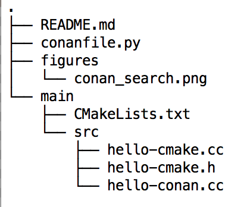
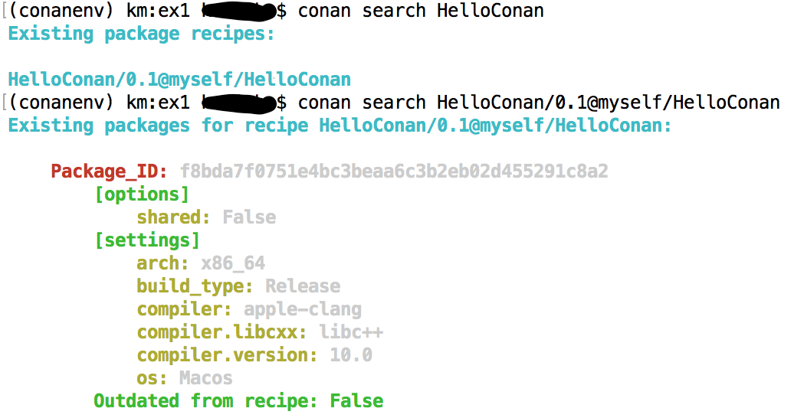

# Ex1: create your first hello_conan package

## Requirements

* Your code to be build with CMake
* CMakeLists.txt
* conanfile.py 

See the file structure below:

## Commands used

* To create a conan package: `cd ex1/` and run `conan create . myself/HelloConan`
* To get a list of packages: `conan search`
* To search for the metadata of a specific package: `conan search HelloConan/0.1@myself/HelloConan` (Useful in checking package ABI compatibility, more on this later..)

