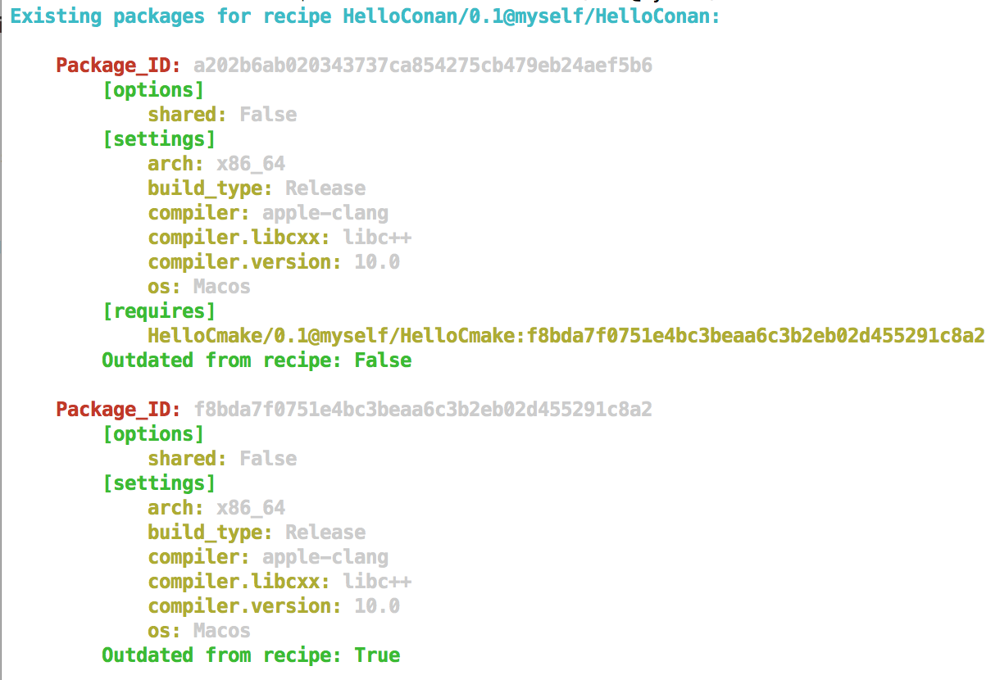

# Ex1: Using an existing conan package as a dependency in your code.

## Requirements

* Your main code to be build with CMake + CMakeLists.txt + conanfile.py 
* Your dependency code to be build with CMake + CMakeLists.txt + conanfile.py 

See the file structure below:

## Commands used

### To create the dependency package

* To create the conan package: `cd ex2/dependency_pkg` and run `conan create . myself/HelloCmake`.
This create the `HelloCmake` package in your local conan cache.

* The dependency to `HelloCmake` is specified within the `requirements()` function in the conanfile.py of `HelloConan`.

* Now to create the `HelloConan` package: `cd ex2/` and run `conan create . myself/HelloConan`.
* To search for the metadata of this HelloConan package: `conan search HelloConan/0.1@myself/HelloConan`. This also lists the dependencies of your package.

